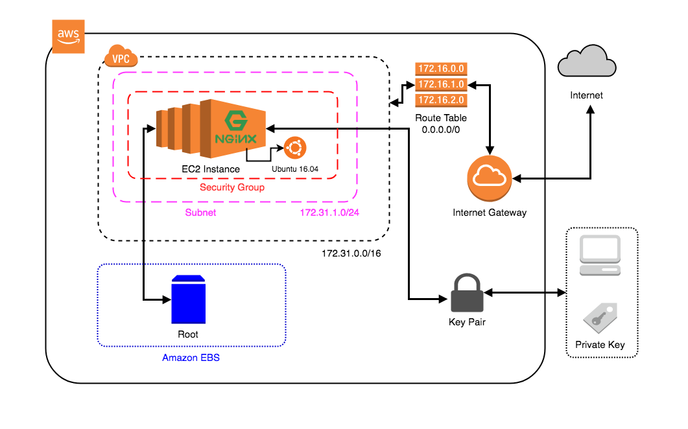

# terraform-myworks

This repository is includes my own projects

Yukarıdaki şema da `172.31.0.0/16` ** CIDR** ’ına ait** ( AWS Default VPC CIDR )** bir **Virtual Private Cloud ( VPC )** bulunmaktadır. Bu **VPC** içerisinde `172.31.1.0/24` ** CIDR** ’ı olan bir **subnet** oluşturulmuş.Bir adet  **Route Table** ’a sahip ve bu `0.0.0.0/0` (Her IP için) **IP** için  **Internet Gateway** ’e attach olmuş durumda. Burada **instance** içerisindeki trafik **VPC** içerisinden  **Route Table** ’a sorulur ve** Route Table** ilgili **IP** setine özel bir tanımlama yok ise `0.0.0.0/0` yani bütün istekleri  **Internet Gateway** ’e yönlendirir.

**Subnet ( **`<strong class="ld jb">172.31.1.0/24</strong>`**) **içerisinde de bir **Elastic Compute Cloud ( EC2 ) instance’ı **bulunmaktadır. Bu instance’in **AWS** tarafından  **EC2** ’lara attach olmuş default 8 GB’lık bir **Elastic Block Storage ( EBS ) **alanı vardır. **Instance** içerisinde **Nginx** çalışmaktadır. Bu instance’a **SSH** ile bağlanabilmemiz için  **AWS** ’de  **host** ’umuzun  **public key’** ine sahip bir **Key Pair** oluşturulmuş.

Bu çalışmanın Terraform aracılığı ile kurulması için yapıyı oluşturacağız.
